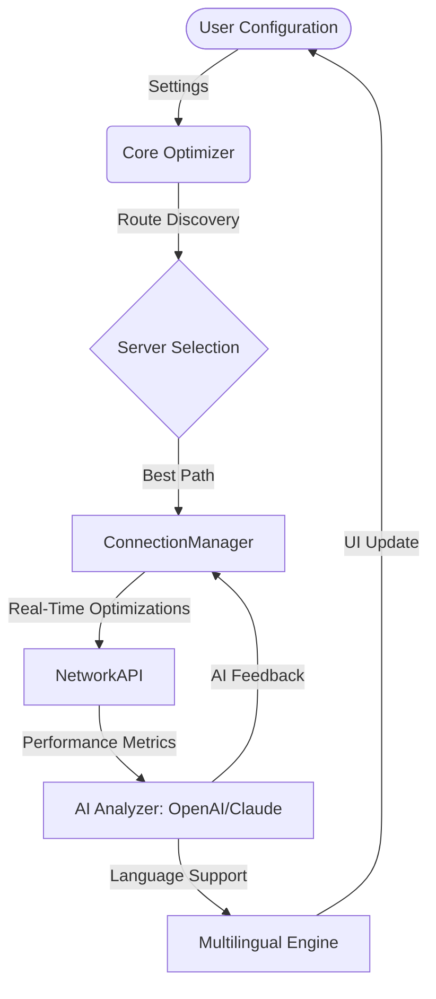

# 🎮 OptiRoute: Next-Gen Game Network Optimizer

**OptiRoute is a next-generation network optimizer crafted for competitive gamers who want smoother online multiplayer experiences, minimal lag, and server flexibility. Combining intelligent routing algorithms, multilingual UI, and advanced AI integrations, OptiRoute offers unparalleled gaming performance for a global community.**

---

## 🚀 Table of Contents

- [Introduction 💡](#introduction-)
- [Mermaid Diagram 🗺️](#mermaid-diagram-️)
- [Features & Benefits 🌟](#features--benefits-)
- [Example Profile Configuration 📝](#example-profile-configuration-)
- [Example Console Invocation ⌨️](#example-console-invocation-)
- [OpenAI & Claude API Integration 🤖](#openai--claude-api-integration-)
- [OS Compatibility Table 🖥️](#os-compatibility-table-)
- [SEO-Focused Keywords and Use Cases 🔎](#seo-focused-keywords-and-use-cases-)
- [Customer Support & Multilingual Experience 🗣️](#customer-support--multilingual-experience-)
- [Disclaimer ⚠️](#disclaimer-)
- [License 📄](#license-)
- [Download Again ⬇️](#download-again-)

---

## Introduction 💡

**OptiRoute** reimagines the possibilities for optimized online gaming. Utilizing adaptive pathfinding, dynamic connection policies, and real-time adjustments based on AI, this tool ensures competitive gamers get peace of mind knowing latency is minimized. Unlike traditional networking tweaks, OptiRoute lets anyone—newcomer or seasoned pro—tailor their network experience like tuning a race car for unique tracks.

With built-in support for OpenAI and Claude APIs, OptiRoute also harnesses generative AI for troubleshooting, bespoke recommendations, and translation support, making network optimization fun, accessible, and globally inclusive.

---

## Mermaid Diagram 🗺️

Explore how OptiRoute orchestrates intelligent network pathways:

---

## Features & Benefits 🌟

- **Adaptive Network Routing:** Intelligent dynamic routing mitigates lag and jitter for online games.
- **AI-Based Analysis:** Integration with OpenAI and Claude APIs delivers instant, natural-language feedback and auto-optimization.
- **Multilingual Interface:** Support for 20+ languages with seamless UI swaps and in-app translation.
- **24/7 Customer Support:** Always-on, chatbot-augmented support for troubleshooting and tips.
- **Platform Versatility:** Windows, macOS, and Linux supported.
- **Detailed Analytics Dashboard:** Monitor real-time and historical latency, jitter, and packet loss.
- **Easy Game Profile Switching:** Pre-built profiles for popular titles; community sharing encouraged.
- **Secure Connections:** End-to-end encryption for peace of mind.
- **Customization Galore:** Fine-tune every aspect, from routing policies to performance thresholds.
- **Responsive UI:** Sleek, modern, and accessible from any device.

---

## Example Profile Configuration 📝

Customize your own profile or import a template. Here’s an example for a fast-paced shooter:

    # GamerTag: FalconRacer26
    [game_profile]
    title = "Apex Legends Ultra"
    region_preference = "EU-West"
    priority = "Lowest Latency"
    fallback_server = "US-East"
    ai_feedback = true
    alerts = ["latency_spike", "packet_loss"]
    language = "English"
    api_integration = ["openai", "claude"]
    encryption = "enabled"

---

## Example Console Invocation ⌨️

Accelerate your connection via the terminal:

    $ optiroute optimize --profile "Apex Legends Ultra" --language de --ai-analysis on --export-report

This command starts optimization with a profile, switches the UI to German, enables live AI diagnostics, and exports a session report.

---

## OpenAI & Claude API Integration 🤖

OptiRoute leverages advanced APIs to elevate your experience:

- **Troubleshooting Chatbot:** Type any connectivity or latency concern—get AI-driven, plain-language advice.
- **Custom Route Recommendations:** Ask “Which server is fastest now?” and receive up-to-date, data-driven suggestions.
- **Multilingual Support:** Translate settings, logs, and support chats instantly.
- **Profiling Suggestions:** AI scans past sessions and recommends custom configs.

---

## OS Compatibility Table 🖥️

|  OS      | Supported | Version Tested | Notes            |
|----------|-----------|---------------|------------------|
| 🪟 Windows  | ✅         | 10, 11         | x64 & ARM        |
| 🍏 macOS    | ✅         | 12+            | Universal build  |
| 🐧 Linux    | ✅         | Ubuntu 22+, Fedora 36+ | DEB/RPM         |

---

## SEO-Focused Keywords and Use Cases 🔎

**OptiRoute** is ideal for:
- Competitive gaming network optimization
- High-speed, low-latency multiplayer connection
- AI-powered game latency analysis
- Dynamic game server switching
- Multilingual gaming tools
- Adaptive network routing for esports
- Secure encrypted connections for gaming
- Real-time network performance analytics

**Scenarios include:**
- Professional eSports events
- Home gaming tournaments
- Cross-region multiplayer sessions
- Game streaming setups (Twitch, YouTube Gaming)
- Remote gaming cafes and LAN parties

---

## Customer Support & Multilingual Experience 🗣️

We believe language should never be a barrier! OptiRoute supports:
- 🌏 Real-time in-app translation for all UI and chat
- 🕓 24/7 support chatbot (AI + human escalation)
- 👥 Community forums and auto-translated documentation
- 📢 Regular multilingual update notes

---

## Disclaimer ⚠️

OptiRoute is a network optimization utility designed to enhance online gaming performance within the guidelines of fair and ethical internet usage. This software does **not** provide unauthorized access, bypass commercial restrictions, or infringe on the intellectual property of third-party providers. Please refer to local statutes and game publisher policies before use.

--- 

## License 📄

This project is released under the [MIT License](./LICENSE).  
Copyright © 2026

---

## Download Again ⬇️

Let the adventure begin!

